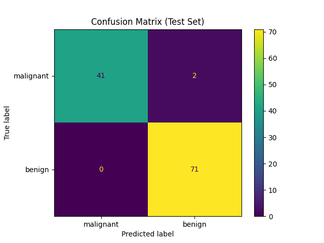
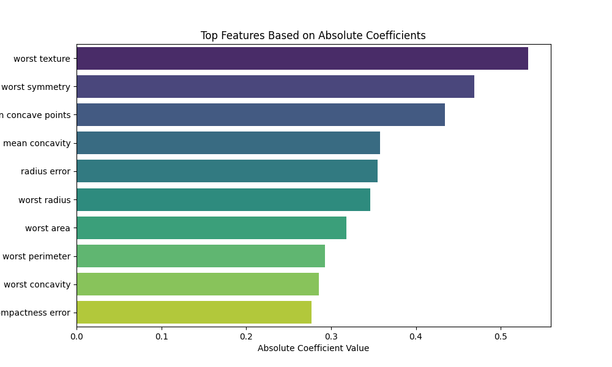

# Breast Cancer  Classification with Support Vector Machines
This project focuses on building a machine learning model using Support Vector Machines (SVM) to classify breast cancer as malignant or benign. Hyperparameter tuning was 
performed for optimal model evaluation. 

## Dataset
The Breast Cancer Wisconsin Dataset from sklearn.datasets was used, containing:
    - 569 samples.
    - 30 features (e.g., radius, texture, smoothness).
    - Two target classes: malignant (cancerous) and benign (non-cancerous).

## Libraries Used
    - pandas and numpy for data manipulation.
    - scikit-learn for modeling and evaluation.
    - seaborn and matplotlib for visualization.

## Installation
### 1. Clone this repository:
    git clone https://github.com/ndunes/SVM-Classifier.git
### 2. Navigate to the project directory:
    cd svm-classifier
### 3. Install the required packages:
    pip install -r requirements.txt

## Project Workflow
### 1. Data Preprocessing:
- Standardized features using StandardScaler.
- Split data into training and testing sets.
### 2. Model Training:
- Tuned hyperparameters for SVM using GridSearchCV.
- Evaluated the best model on test data.
### 3. Performance Evaluation:
- Generated a classification report.
- Created a confusion matrix visualization.
### 4. Feature Importance:
- Examined SVM coefficients to identify top features.

## Results
Best Model: SVM with parameters:
- C = 0.1
- gamma = 1
- kernel = 'linear'
- Test Accuracy: 0.98
- Cross-Validation Score: ~ 0.9736

## Visualizations
### 1. Confusion Matrix:

### 2. Top Features: A bar chart displaying the top 10 features based on absolute coefficient values.

## Acknowledgments
- https://scikit-learn.org/0.21/documentation.html
- https://matplotlib.org/stable/index.html
- https://seaborn.pydata.org/
